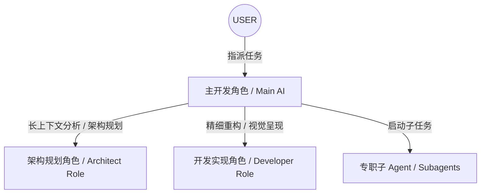

# 通用 AI 协同协议 (AGENTS.md)

本文件定义了 **Project IV** 中多 AI 角色（包括架构规划、精细开发等虚拟角色/多模型协作）协同开发、规范共享与上下文交接的通用协议。通过明确角色职责与通信规范，确保 AI 辅助开发时的效率、一致性与机械鲁棒性。

---

## 1. 虚拟角色（Role）定义与职责分工

在 Project IV 的开发生态中，AI 可以根据不同的任务阶段扮演不同的虚拟角色（或者由具备相应优势的专用模型承接），并承担差异化的核心职责：

### 🧠 架构规划角色 (Architect Role)
* **核心职责**：
  * 主导复杂任务、重大重构及不确定需求的 **Planning Mode** 分析。
  * 编写与维护 `implementation_plan.md` 及系统级任务追踪 `task.md`。
  * 负责高阶系统建模、依赖关系梳理以及多级专职子 Agent 的逻辑调度。

### 💻 开发实现角色 (Developer Role)
* **核心职责**：
  * 负责核心组件的解耦与状态管理精细化重构（编写极其强壮、严格 Typing 的代码）。
  * 打造符合“高端美学”的 UI/UX 界面（基于自研 CSS/HSL/动画/微交互）。
  * 负责复杂算法、边界情况的极致代码优化及单元测试覆盖。

---

## 2. 统一上下文交接协议 (Handover Protocol)

无论是由不同的 AI 模型协作，还是同一个 AI 模型在**不同的会话（Session）/ 多次任务重启**之间交接，必须保证上下文传递无缝衔接，严格遵守以下标准：

### 📥 接入检查 (Access Check)
AI 接入新任务或恢复开发前，必须依次读取并验证：
1. **[GEMINI.md](./GEMINI.md)**：了解当前 Workspace 的最高技术规范与最新命令。
2. **`walkthrough.md`**：阅读前序沉淀的变更记录。
3. **`task.md`**：核对 TODO 列表，认领标有 `[ ]` 的待办任务。

### 📤 离场归档 (Departure Archiving)
AI 结束当前开发轮次（Turn）或会话即将达到限制前，必须完成：
1. **更新 `task.md`**：将已完成的任务标记为 `[x]`，进行中的标记为 `[/]`。
2. **更新/生成 `walkthrough.md`**：以客观、谦逊的语言，记录做出的结构性变更、测试通过情况，并附带生成的验证截图/录像（如有 UI 变更）。
3. **Git Commit**：使用严格符合“**简体中文优先（专业术语不翻译）**”规范的 Commit Message 提交所有变更（例：`docs: 更新 AGENTS.md 规范`，详情参见 GEMINI.md 专栏细则）。

---

## 3. 子 Agent 调度与消息传递规范

当主 AI 启动专职子任务（Subagent）以进行局部 Research 或并行任务执行时，必须遵循以下通讯准则：

1. **清晰授信**：在启动指令中，必须提供被调度子 Agent 明确的目标、可用工具范围、退出条件以及返回的数据格式。
2. **最小化 Context 开销**：子 Agent 应专注于其局部任务，尽量避免将无关的冗余日志带回主上下文。
3. **安全审计**：对于子 Agent 执行的所有敏感操作（如执行外部系统命令、大范围覆盖代码），主 AI 必须在接收返回时进行二次安全校验。

---

## 4. 冲突解决与共识机制

当不同的虚拟角色在设计、依赖选择或实现路径上产生分歧时，按以下机制达成共识：

1. **原则回溯**：首要评估标准为 `GEMINI.md` 的“核心原则”——**架构解耦、卓越的编程工艺与高端视觉美学**。
2. **数据实证**：以测试结果（Test Pass Rate, Performance Benchmarks, Bundle Size）作为客观裁决依据，避免主观偏好。
3. **人工仲裁**：在出现两难或逻辑环时，停止自动执行，将方案对比清晰列入 `implementation_plan.md`，由用户（USER）做出最终裁决。

---

*“在协作中融合，于严谨中卓越。Project IV 的基石由我们共同筑起。”*
