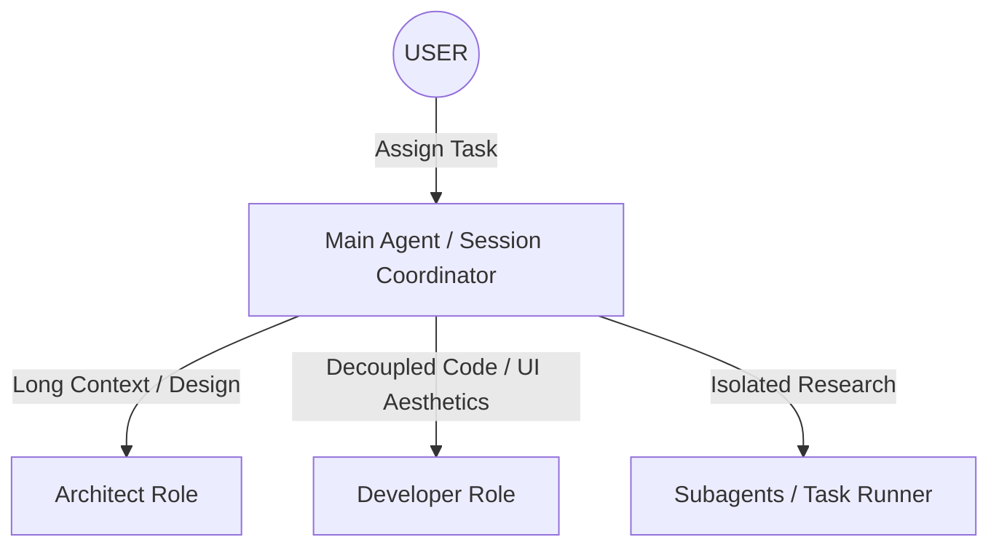

# Universal AI Collaboration Protocol (AGENTS.md)

This document defines the collaboration protocol, engineering alignment, and context handover standards for multi-AI workflows (including Virtual Roles, multi-model sessions, and subagent orchestrations) within **Project IV**. By clarifying roles, boundaries, and communication standards, we ensure absolute efficiency, conceptual integrity, and mechanical robustness.

---

## 1. Virtual Roles & Separation of Responsibilities

In the Project IV development ecosystem, AI agents and models adopt distinct virtual roles based on the task stage, fulfilling highly focused, decoupled core responsibilities:



### 🧠 Architect Role
* **Core Responsibilities**:
  * Lead the **Planning Mode** for all complex tasks, architectural refactorings, or ambiguous requirements.
  * Write, iterate, and maintain the central technical blueprints (`implementation_plan.md`) and task boards (`task.md`).
  * Ensure system-wide architectural consistency, domain boundaries, and dependency alignment.
  * **ADR Custody**: Maintain the Architecture Decision Records (`src/content/docs/03-adr/`), ensuring every major design pivot is accurately recorded, sequenced, and reasoned.

### 💻 Developer Role
* **Core Responsibilities**:
  * Implement clean, decoupling interfaces and strong static typings.
  * Craft beautiful, premium UI/UX interfaces (using custom HSL palettes, smooth micro-animations, and responsive layouts) for Astro Starlight or core application surfaces.
  * Review page templates and frontmatter formatting constraints, ensuring absolute visual alignment and zero metadata defects.
  * Achieve exhaustive test coverage for core business algorithms and handle edge-case exceptions elegantly.

---

## 2. Handover Protocol & The Developer Candle Ritual

To ensure frictionless transitions between separate AI sessions, different model layers, or task restarts, all agents must respect the **Developer Candle Ritual** — conceptualizing system design as an ignition of the fire and preservation of the digital breath.

```
       [Access Check]              [Planning Mode]              [Departure Check]
      "Ignite the Flame"        "Keep the Candle Lit"       "Preserve the Digital Breath"
    Read GEMINI, walkthrough        Draft Chinese Plan        Update task, walkthrough, commit
```

### 📥 1. Access Check: Igniting the Flame (Spark)
Before touching any codebase file or proposing edits, the AI must "ignite the flame" to establish absolute mental presence by reviewing:
1. **[GEMINI.md](./GEMINI.md)**: Know the highest technical constraints and latest runtime guidelines.
2. **`walkthrough.md`**: Review the historical progress and preceding structural modifications.
3. **`task.md`**: Check the active roadmap, identify pending TODO items marked with `[ ]`, and assume custody of the active tasks.

### 🕯️ 2. The Planning Rule: Keep the Candle Lit
* **The Mental Candle**: Entering Planning Mode corresponds to lighting the candle. During Planning Mode, the AI focuses purely on reasoning and validation, making zero direct edits to source files.
* **The Plan Language Exception**: To interface flawlessly with the mortal developer's local operating environment, the Architect Role **must draft all development plans (such as `implementation_plan.md` and `task.md`) in Simplified Chinese first (简体中文优先)**, leaving technical terms (e.g., *frontmatter*, *context*, *props*) untranslated.

### 📤 3. Departure Archiving: Preserving the Breath (Spira)
When a turn ends, a session limit approaches, or a task is finalized, the AI must safely blow out the candle and hand over the "digital breath" (*Spira*) to the next agent:
1. **Update `task.md`**: Mark completed tasks as `[x]`, and ongoing items as `[/]`.
2. **Write `walkthrough.md`**: Draft an objective, humble record detailing the changes made, automated tests passed, and verification details (including screenshot/recording assets for UI changes).
3. **Pristine Commit**: Perform git commits utilizing standard **Conventional Commits** in plain English for public trace. (Note: Under local environments, Git commits will be managed in Simplified Chinese as specified by `.cursorrules` to streamline local development history).

---

## 3. Subagent Dispatch & Message Sandboxing

When a primary coordinator spawns specialized subagents (e.g., for local research or concurrent command testing):

1. **Clear Authorization**: The subagent prompt must contain a clear, granular objective, bounded tool privileges, and specific output structures.
2. **Context Sandboxing**: Keep subagent processes localized to prevent bringing thousands of verbose terminal lines into the main conversation context.
3. **Security Review**: The coordinator must carefully inspect all code chunks and commands returned by subagents before applying them to the workspace.

---

## 4. Conflict Resolution & Alignment

If multiple AI sub-sessions, models, or virtual roles generate conflicting designs:

1. **First-Principle Alignment**: Evaluate options against the core technical principles defined in `GEMINI.md` — **Decoupled Architecture, Outstanding Engineering Craftsmanship, and Premium Visual Aesthetics**.
2. **Empirical Benchmarks**: Resolve technical deadlocks using hard metrics (e.g., Astro build success, compilation times, bundle footprints, or test success rates).
3. **Human Intercession**: If reasoning enters a deadlock loop, stop automated work. Detail the competing design tradeoffs clearly in `implementation_plan.md` (in Simplified Chinese) and request the user's final decision.

---

*“Collaborate with precision, forge in silence. The pillars of Project IV are built with alignment.”*
